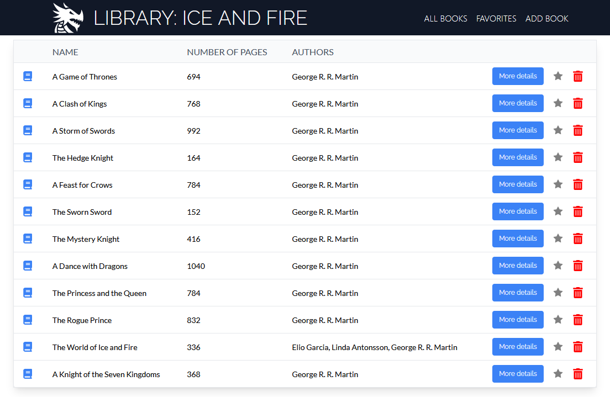

# Libreria con "API of Ice and Fire"

## Resumen

Este proyecto muestra y organiza libros, pudiendo agregar, borrar, agregar a favoritos y mostrar los principales detalles de estos. Se utilizaron como herramientas principales React, TypeScript, Tailwind, Jest y Storybook.

## Instalación

Los pasos para la instalación del proyecto son los siguientes:

1. Clonar el repositorio en su máquina local utilizando `git clone https://github.com/matalvarez10/ice-and-fire-api`.

2. Ir a la carpeta del proyecto.

3. Instalar las dependencias necesarias con `npm install`.

4. Iniciar el servidor de desarrollo con `npm run dev`.

## Pruebas unitarias

Los pasos para ejecutar las pruebas con Jest son:

1. Asegúrese de haber instalado las dependencias necesarias con `npm install`.

2. Iniciar las pruebas utilizando `npm run test`.

## Storybook

Los pasos para visualizar la documentación con Storybook son:

1. Asegúrese de haber instalado las dependencias necesarias con `npm install`.

2. Iniciar Storybook utilizando `npm run storybook`.

## Información Adicional

1. ¿Cómo decidiste las opciones técnicas y arquitectónicas utilizadas como parte de su solución?
   - Decidí utilizar TypeScript debido a la experiencia previa que tengo trabajando con este lenguaje, además de la utilidad que tiene al momento de trabajar con datos estructurados, gracias a los tipos/interfaces. También utilicé Tailwind, debido a que me permite desarrollar de manera más ágil los estilos de la aplicación.

2. ¿Hay alguna mejora que dejaste pendiente de hacer en su envío?
   - Principalmente añadir una mayor cantidad de pruebas unitarias, y además agregar la totalidad de componentes a la documentación de Storybook.

3. ¿Qué harías de manera diferente si se le asignara más tiempo?
   - Utilizar alguna herramienta para almacenar los datos del usuario, como LocalStorage o la implementación de una base de datos.
   - Hacer deploy.